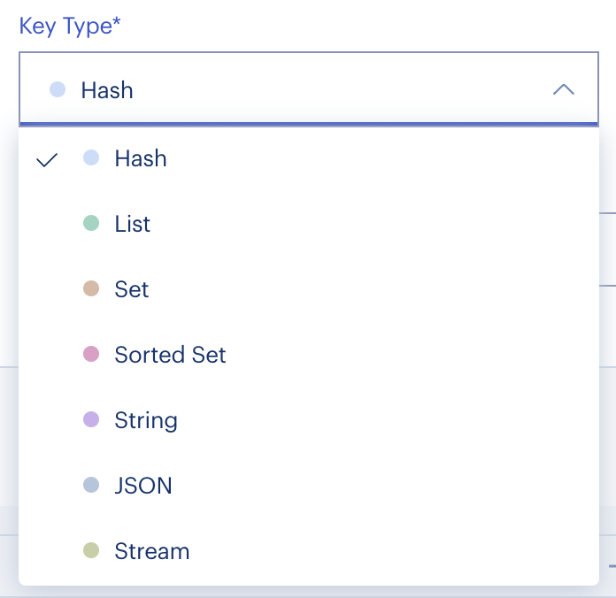
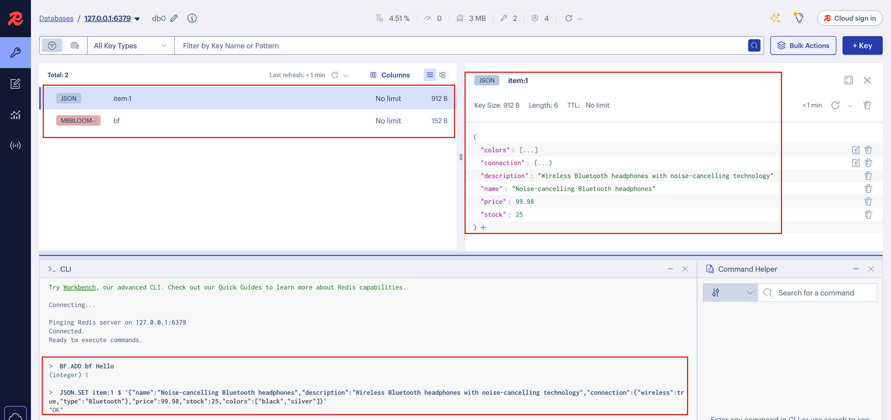

# Dragonfly
大概两年前说是比redis快，火极一时。现在试用一下。

# 安装文档
[Install with Docker](https://www.dragonflydb.io/docs/getting-started/docker)

# 命令种类
[api_compatibility](https://www.dragonflydb.io/docs/command-reference/compatibility)

除ACL权限控制之外，支持这些命令：
- Bloom Filter
- Generic
- Geospatial Indices
- Hashes
- HyperLogLog
- JSON
- Lists
- Pub/Sub
- Rate Limiter
- Search
- Server Management
- Sets
- Sorted Sets
- Streams
- Strings

相比较Redis没有或者需要额外插件的功能，Dragonfly支持：`Bloom Filter`、`JSON`、`Rate Limiter`、`Search`。

# 客户端使用
Dragonfly支持使用[redis-cli](https://redis.io/docs/latest/operate/rs/references/cli-utilities/redis-cli/)作为客户端，但由于是新电脑，本地还没下redis-cli，所以使用`Redis Insight`作为图形界面客户端。

作为官方提供的图形界面客户端，有这些数据类型可以操作：

所以对于其他命令，就用下方的终端进行输入。可以看到协议中应该包含了数据的名称、类型、大小，所以左侧数据列表能显示布隆过滤器数据的信息。

# 总结
1. 安装挺方便，而且自带很多功能。
2. 官方也提供了较详细的文档，易于上手。
3. 对Redis兼容较好，容易从Redis迁移过来。
4. 对于企业肯定还是使用成熟的Redis比较稳妥，但个人开发者为了提升开发效率、试用新技术，还是可以考虑使用Dragonfly。